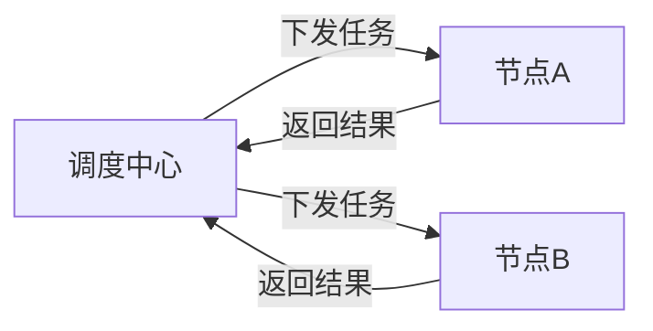
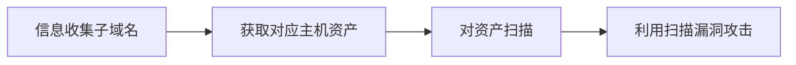
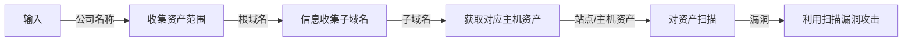
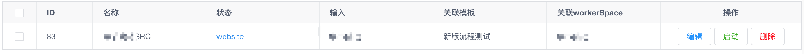
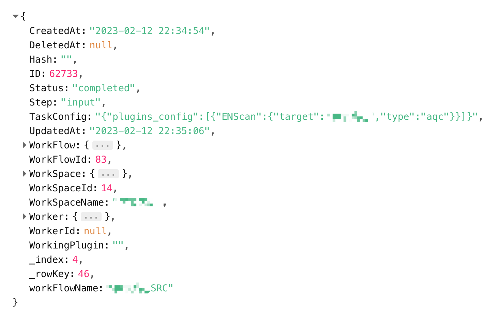
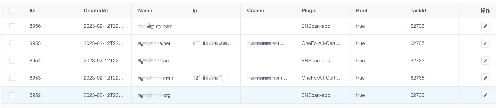
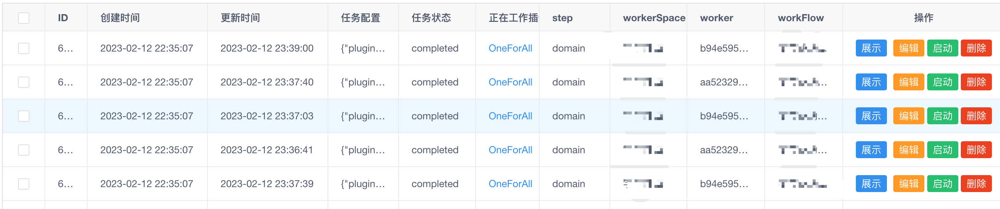
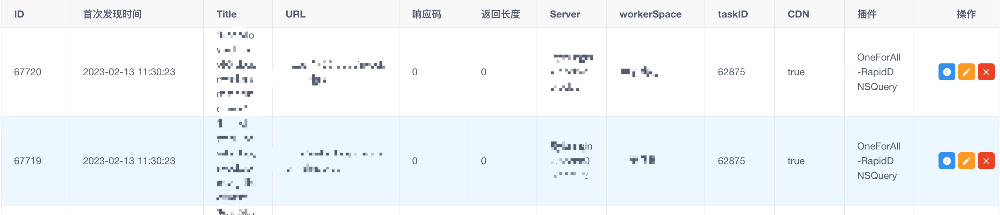
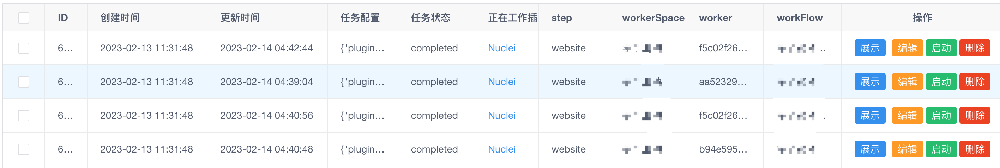

# PokemonScan

## 背景
`每个安全工程师都有自己的一个扫描器`   
可能是集成了某些开源扫描器的能力，可能是自己从头写的一套。  
扫描器的能力上限经常成为红队打点、SRC挖掘的能力上限。  
所以一个好的扫描器应该能具有哪些能力？

- 集百家之大成    
对于安全工程师来说，运气真的是个重要因素。很多时候真的是在`捡漏`。运气好的时候，赶上业务刚刚上新，拿十年前的扫描器都能交个严重漏洞；
不过大多数接手的都是被一轮又一轮日过的站，需要不断提升扫描能力才有可能从`前人`的手里捡几个`漏`洞。   
`提升扫描能力` 意味着 更多的 poc ， 更巧妙的绕过， 更新的payload。
所以我们可能需要下一堆工具，xx工具能挖掘到别的工具挖不到的域名，xx工具的xss payload绕过能力最强，xx工具的poc最全,然后对一堆工具进行复杂的配置。
每次换个机器就要重复一次配置环境、配置参数的流程。

- 全流程扫描   
`扫描器` 的概念似乎也在不断的迭代  
从 `payload 发送机` -> `爬虫 + payload ` -> `被动扫描器`   
而现在的 `扫描器` 几乎又开始建设自己的 `工作流程`，不只是 payload 发送，从`信息收集`到`漏洞扫描`都集成其中，甚至集成了`写报告`的能力：）
越来越接近`躺着受洞`的目标

- 手动自动结合   
扫描不是万能的，但没有扫描是万万不能的。   
在有一天我又挂着扫描器，打开burp，观察敏感包的时候，突然发现自己其实只不过是一个能够处理验证码，有着很多条特征规则的`主动爬虫`：（  
我想是不是可以把我脑子里的`可能存在漏洞的包` 提取成规则，交给一个真正的爬虫去处理。我只专注于可能产生漏洞URL，这将为我节省大量时间。

所以我们需要一个扫描器，他需要有以下能力：

- 安装部署环境简单，一键安装各个最新最全扫描能力，一次配置，多次使用
- 更新简单，各个扫描能力能够独立更新
- 能够涵盖渗透测试各个环节
- 具有手动自动结合能力

我在github上找了很久，也没有找到这样一个扫描器。  
索性自己动手，解决以上问题

**Let's do it!**

## 设计架构

PokemonScan   

> 灵感来自宝可梦的`精灵球`，每个插件都是一个精灵球。 在不同的回合出动不同的精灵球，通过不同的组合，实现不同的能力。

采用分布式扫描，分为一个调度中心和多个扫描节点。

### 调度中心 [daycare]

`任务`作为扫描的最小调度单元，调度中心以`工作流`的形式不断的产生任务， 并把下发配置给扫描节点。

### 工作节点 [pokeball]

扫描节点以容器的形式允许插件并接受服务端的扫描配置，完成扫描任务，上报给调度中心。

## 工作流程

PokemonScan 提取了渗透测试中的五个元数据

- 站点
- 域名
- 主机
- 漏洞
- 其他信息

在渗透测试的不同阶段，也会利用到不同信息。对于常规的一个公司渗透流程来说

具体到数据结构上

随着渗透经验的丰富和能力的提升，在各个环节可能都会有些更新更好用的工具，但是并不会影响整体流程的变化。
当我们统一了各个工具的输入输出，就可以无缝接入我们的渗透流程。

## 实现效果

输入公司名

利用`ENScan`搜索相关资产，拿到根域名

对根域名使用OneForAll扫描,扫出 Website 资产

利用扫出来的 Website 资产进行漏洞扫描

喝杯☕️，然后等待漏洞上报~

## 更多

> * 快速开始
>   * [安装](/zh-cn/快速上手/install)
> * 最佳实践
>   * [SRC通用扫描流程](/zh-cn/最佳实践/src_scan)