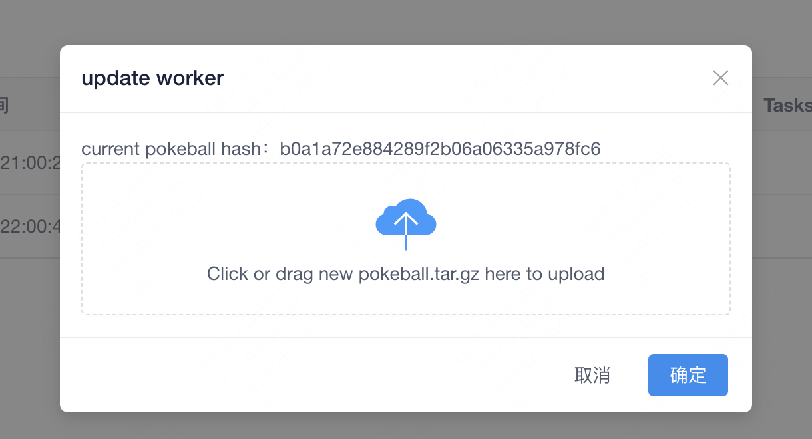

## 服务端更新

在安装服务端的服务器上执行如下命令:
```bash
docker pull pokemonscan/daycare:latest
docker rm -f daycare_server_1
docker-compose up -d
```

服务端中会有新的worker, 手动重启worker即可更新

## 单 worker 更新



将仓库中最新 / 自己本地开发打包好的 `pokeball.tar.gz` 上传,重启所有 `worker` 发现版本和服务端相同,即更新成功
