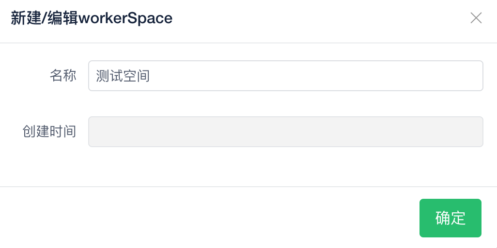
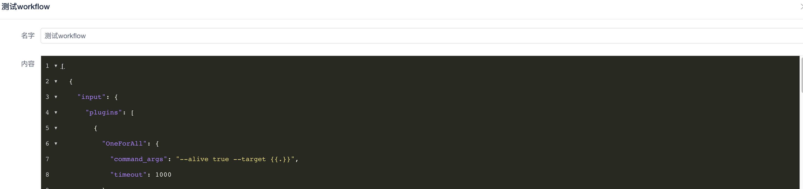
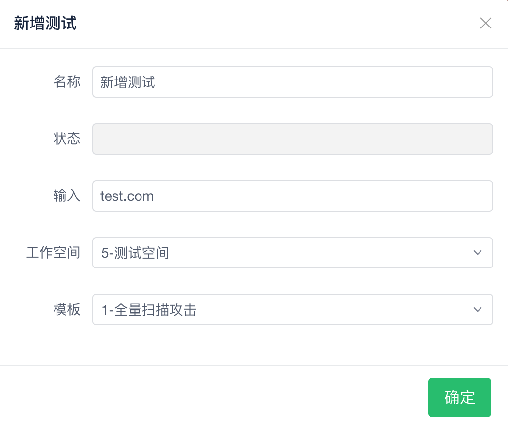
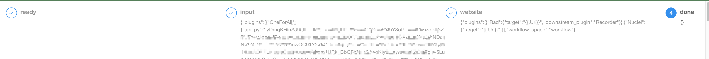

## 新建workspace

在 workspace 管理页面创建 一个新的 workspace




## 配置扫描 workflow 模板

> workflow 模板详细配置见后文档描述

这里给一个扫描的 workflow 模板 demo

```json

[
  {
    "input": {
      "plugins": [
        {
          "OneForAll": {
            "command_args": "--alive true --target {{.}}",
            "timeout": 1000
          }
        }
      ],
      "workflow_space": "workflow"
    }
  },
  {
    "website": {
      "plugins": [
        {
          "Rad": {
            "target": "{{.Url}}",
            "downstream_plugin": "Recorder"
          }
        },
        {
          "Nuclei": {
            "target": "{{.Url}}"
          }
        }
      ],
      "workflow_space": "workflow"
    }
  }
]
```

这个 workflow 包含 2 个阶段 ，三个插件



## 增加 workflow 并启动




## 等待工作完成



等到状态变为 `done` 的时候，请查收你的漏洞 🫢